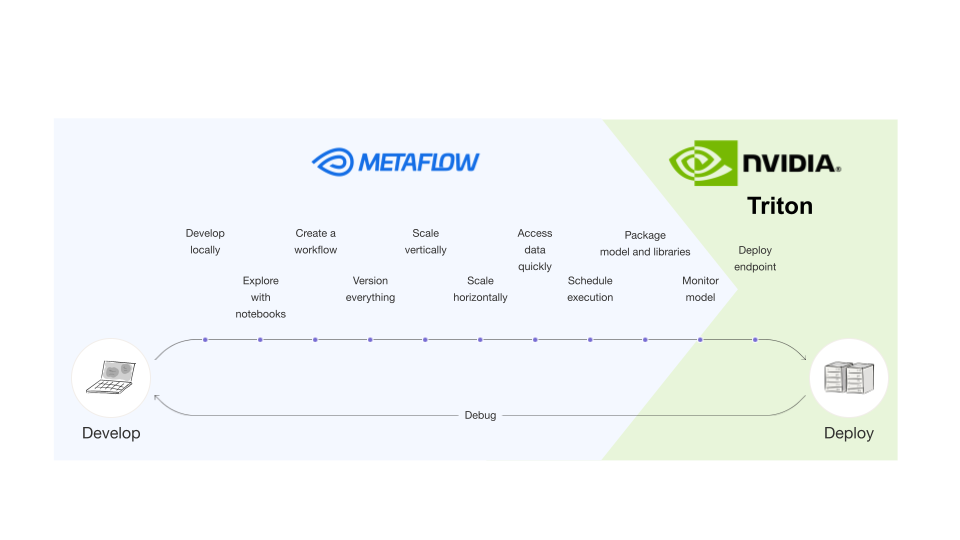
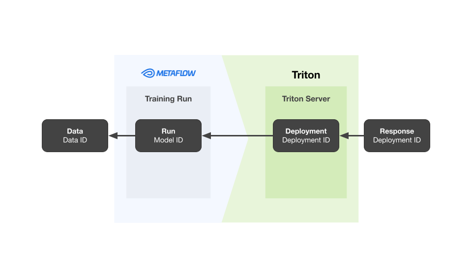
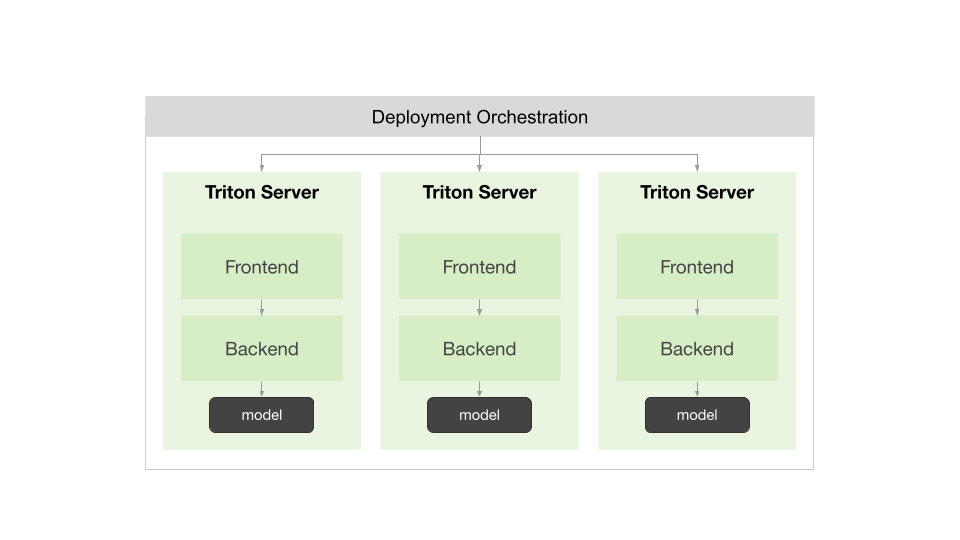

<table>
    <tr></tr> 
    <tr>
        <td style="padding-top: 100px"> 
        <td style="padding-top: 100px">  
    </tr>
</table>

# What is this repo

This code will help you get started using NVIDIA's [Triton Inference Server](https://developer.nvidia.com/triton-inference-server) and [Outerbounds](https://outerbounds.com/platform) (built on open-source [Metaflow](https://docs.metaflow.org/)).

# How to use this repo

There are subdirectories each containing different getting started toolkits for using Triton with Outerbounds. You can find detailed instructions in the README files in each subdirectory.
- The [trees](./trees) repository provides a template for how to use Metaflow to orchestrate training and tuning of Scikit-learn, XGBoost, or LightGBM models, pushing the resulting model to cloud storage so it is ready to be used on a Triton Inference Server.
- The [llm](./llm) repository provides a template for how to use Metaflow to orchestrate fine-tuning for transformer models, pushing the resulting model and tokenizer state to cloud storage so it is ready to be used on a Triton Inference Server.

# What you need to get the most out of it
- Set up an inference server where you want to host models.
    - Best to have a GPU for `/llm` 
- Access to a [Metaflow deployment](https://outerbounds.com/engineering/welcome/)